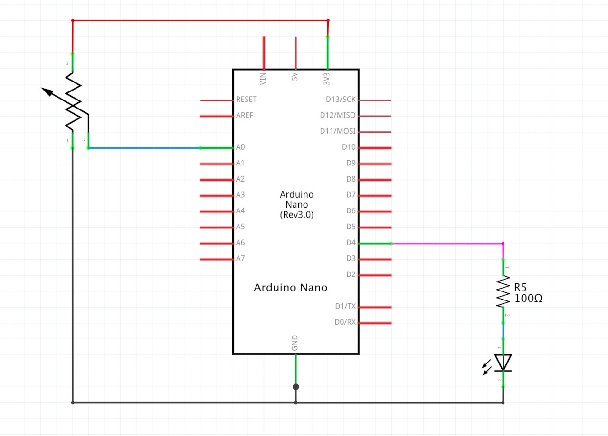
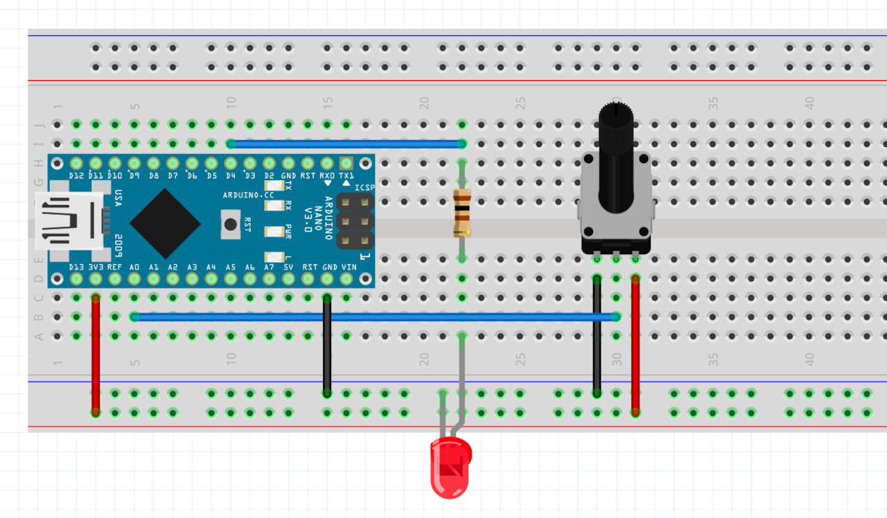
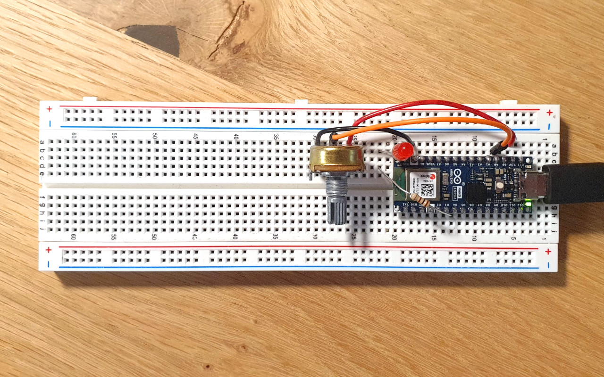
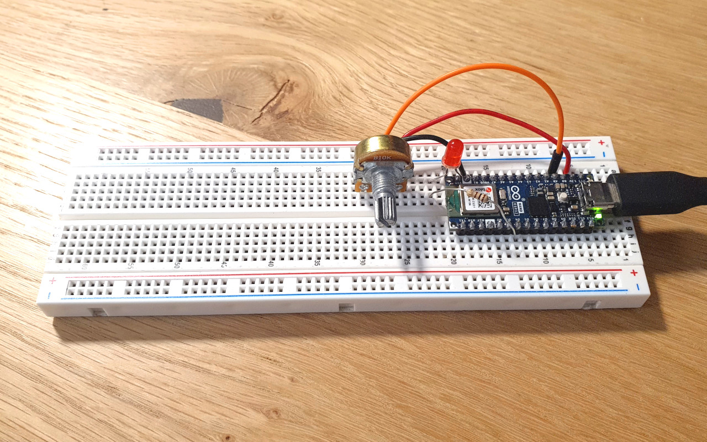

# HW12 - WiFi

Maze game from week09 ([code](https://github.com/DM-GY-6063-2023F-D/week09/tree/main/play-maze), [original game](https://dm-gy-6063-2023f-d.github.io/week09/play-maze/)), but updated to use an Arduino with a potentiometer to control it.

## POST request: p5js -> Arduino

The p5js sketch sends the following object as a JSON to the Arduino to indicate the successful completion of a level:

```
data: {
  success: 1
}
```

## GET request: Arduino -> p5js

The object that is created by the Arduino and sent to p5js looks like this:

```
data: {
  A0: {
    value: integer,
    delta:  [-1, 0, 1]
  }
}
```

```A0.delta``` is used to update the rotation of the maze: a positive delta means rotate left by 1°, a negative delta means rotate right by 1°, and a zero means no rotation.

## Schematic



## Board



## Actual Board




## Video
